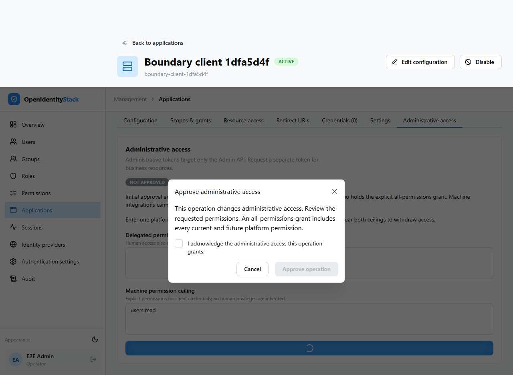
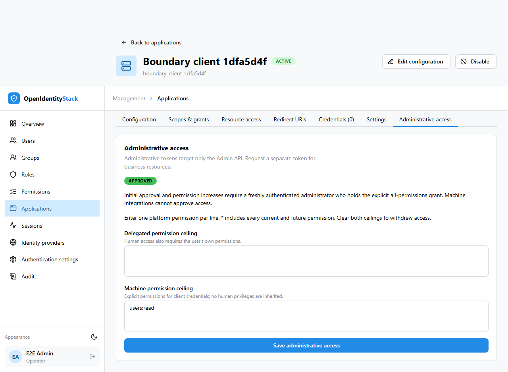

# Administrative client access

The Admin API accepts tokens whose only audience is `urn:openidentitystack:admin-api`, with the `ois.admin` scope. Generic `api`, missing audiences, business audiences, and combined administrative/business audiences are rejected. Business access requires a separate token.

## Entitlement and ceilings

Each administrative client needs an explicit grant to the reserved Admin resource, with separate delegated and machine permission ceilings. An ordinary client's scopes, role names, or resource mappings do not establish this entitlement. The reserved resource identity, scope, and `openidentitystack` permission namespace cannot be reassigned through ordinary resource configuration.

Delegated permissions are the intersection of the user's current permissions, the client's delegated ceiling, the Admin resource, and the issued token's permissions. Client credentials use only the approved machine ceiling. A machine identity does not inherit a user's roles. Both use canonical `permission` claims; alternate `permissions`, `scope`, `scp`, and role claims do not convey administrative authority.

Authorization consults current resource projection once per request. Current client approval, active status, subject authority, and ceiling continue to constrain previously issued tokens. Reducing a ceiling cannot be undone by refreshing a token. A refresh cannot gain permissions absent from its original token.

## Operator workflow

Open the application's **Administrative access** tab. Enter separate delegated and machine ceilings using one platform permission per line. Use concrete permissions for routine integrations; `*` includes current and future platform permissions. Clear both ceilings to withdraw administrative access.

Initial approval and expansion require an existing explicit all-permissions holder, actual human authentication within five minutes, acknowledgement, and durable audit. Stale authentication starts a fresh sign-in and requires the operator to repeat the operation. Cancellation does not submit an approved retry. Reductions preserve existing endpoint permissions and do not require a new approval.

OAuth settings, new credentials, and re-enabling an entitled client use the same human approval boundary because these operations could transfer the client's access. Ordinary application edits cannot create an entitlement. Metadata changes, disabling, credential revocation, and entitlement reduction remain available under their existing permissions.

The API exposes `GET` and `PUT /api/admin/applications/{id}/administrative-access`. The response contains `approved`, `delegatedPermissions`, `applicationPermissions`, and nullable `revision`. PUT supplies both ceilings and `expectedRevision`; use null for a new entitlement. A stale revision returns 409. Approval failures return the 403 Problem Details codes described in [unrestricted administrative approval](unrestricted-administration.md).

## Management Web preparation and cutover

The migrator prepares only the fixed `management-web-client` registration, with `ois.admin`, authorization code plus PKCE, and independently reviewed redirect URIs configured under `OpenIddict:Clients:ManagementWeb`. Preparation alone does not approve it.

For controlled initial deployment, explicitly set `Seed:AdministrativeAccess:BootstrapManagementWeb=true` for one migrator run. This flag is off by default. It grants the known Management Web registration a delegated `*` ceiling and no machine permissions. The bootstrap validates the existing public-client identity, PKCE, allowed grant types, absence of credentials, and exact configured redirect/post-logout URI sets. It refuses mismatches and disabled registrations. Remove the flag after successful bootstrap.

An existing grant is never expanded or restored by bootstrap reruns, including an empty grant retained after withdrawal. The bootstrap does not approve ordinary registrations or provide a runtime recovery endpoint. Other integrations must receive explicit human approval.

Before enabling the boundary, preserve and test an independently accessible emergency human administrator and review the Management Web deployment configuration. Apply resource persistence migrations, prepare registrations, perform the controlled bootstrap if required, approve other integrations, and execute the coordinated credential cutover in [ADR 0005](../adr/0005-identity-and-administrative-trust-boundaries.md). Require fresh administrative tokens. There is no generic-`api` compatibility mode. Downgrading reopens the old administrative boundary.

## Browser verification

The following screenshots show the approval workflow exercised by the real-browser test against an isolated PostgreSQL database. Cancelling approval leaves the client unapproved; acknowledgement enables the requested scoped grant.

