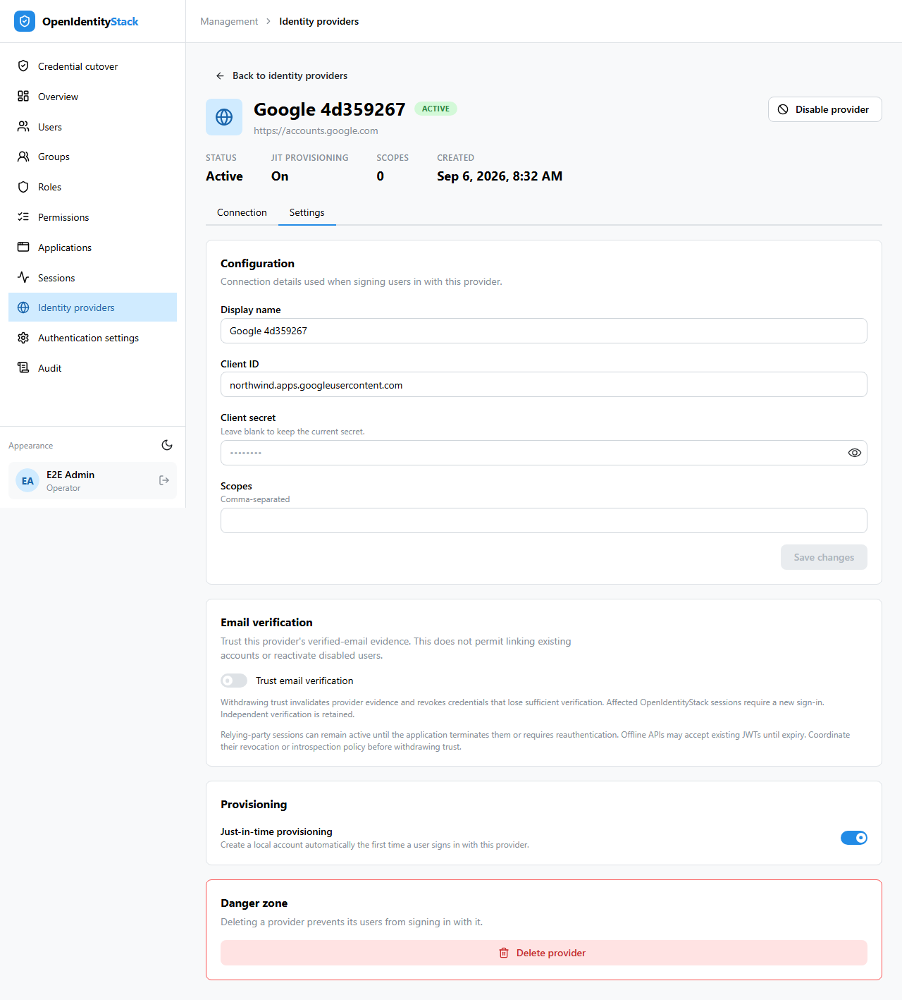
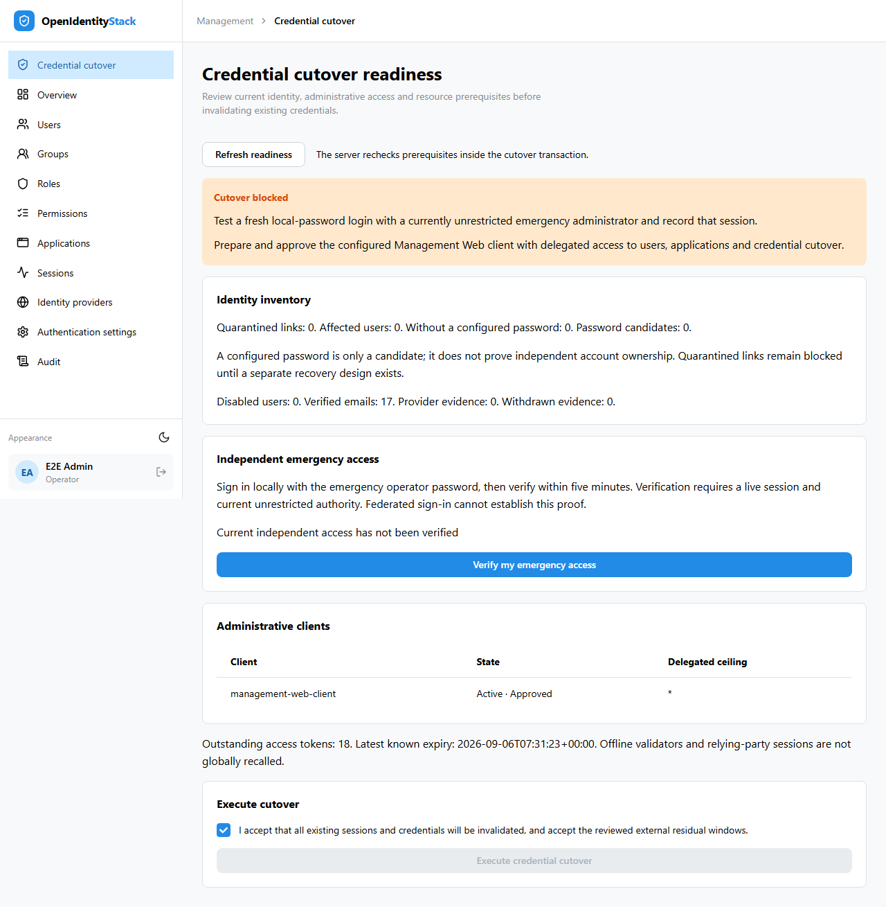
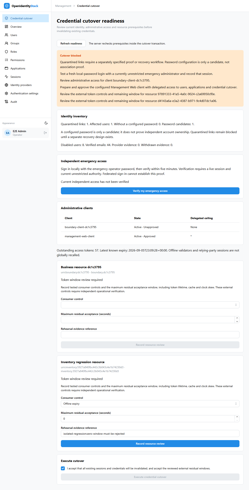

# Identity boundary implementation evidence

The twelve tickets implementing [ADR 0005](../adr/0005-identity-and-administrative-trust-boundaries.md) are delivered as dependent pull requests in GitHub stack 458. They address the accepted identity and privilege boundaries; this is implementation evidence, not a new standards scan or formal OIDC certification. Production cutover has not been executed.

## Delivered behavior

| Ticket | Implemented boundary |
| --- | --- |
| [445](https://github.com/Tjeerd-menno/open-identity-stack/issues/445) | Reject email collisions and identifier-only linking; commit new federation associations and their audit atomically; translate expected concurrent identity conflicts to generic audited denial. |
| [446](https://github.com/Tjeerd-menno/open-identity-stack/issues/446) | Preserve local disablement through federation, cookies, token issuance and create-only bootstrap. |
| [447](https://github.com/Tjeerd-menno/open-identity-stack/issues/447) | Bind links to the exact validated issuer; freeze the provider identity configuration after linking. |
| [448](https://github.com/Tjeerd-menno/open-identity-stack/issues/448) | Retain and inventory unproven legacy associations as quarantined evidence; block authentication and ordinary unlinking. |
| [449](https://github.com/Tjeerd-menno/open-identity-stack/issues/449) | Derive verified email from explicit provider trust and current-address provenance, independently of activation. |
| [450](https://github.com/Tjeerd-menno/open-identity-stack/issues/450) | Require fresh human approval, acknowledgement and audit for explicit unrestricted grants; reject stale authority mutations atomically. Role names convey no authority. |
| [451](https://github.com/Tjeerd-menno/open-identity-stack/issues/451) | Use explicit resources, scopes, namespaces and client ceilings; intersect delegated subject authority with the client grant. |
| [452](https://github.com/Tjeerd-menno/open-identity-stack/issues/452) | Require the dedicated administrative audience and client entitlement; guard client approval, expansion and takeover paths, including concurrent enablement. |
| [453](https://github.com/Tjeerd-menno/open-identity-stack/issues/453) | Evaluate current persisted administrative authority on each request and audit authority mutations in the committing transaction. |
| [454](https://github.com/Tjeerd-menno/open-identity-stack/issues/454) | Withdraw provider-derived verification and invalidate affected credentials while preserving independent verification. |
| [455](https://github.com/Tjeerd-menno/open-identity-stack/issues/455) | Persist a global credential epoch, reject pre-cutover credentials, and make transactional cutover retries idempotent. |
| [456](https://github.com/Tjeerd-menno/open-identity-stack/issues/456) | Gate cutover on real emergency access, identity quarantine, prepared clients and reviewed external token windows; provide UI, rehearsal and rollback guidance. |

## Initial verification

The integrated implementation was checked on 6 September 2026. Final backend verification targets `162a98b2a990ce7964dd270e1e92bfd06fa0365c`; subsequent documentation-only changes record these results.

| Check | Result |
| --- | --- |
| Solution build with analyzers | Passed; one existing ASPIRE010 configuration warning, zero errors |
| Domain | 477 passed |
| Application | 544 passed |
| Infrastructure | 454 passed |
| API unit | 74 passed |
| API integration | 448 passed |
| Contract | 61 passed |
| Architecture | 6 passed against a clean tracked-source export |
| Management Web | Build and lint passed; 62 tests passed |
| Shared administrative API client | 41 tests passed |
| PostgreSQL/Aspire/Chromium browser suite | 59 passed on `51ca7dd`; no failures or skipped cases |
| PostgreSQL authority concurrency regressions | 9 passed on PostgreSQL 18.3; the same races also passed on SQLite |
| EF migration model | No pending model changes |
| Documentation | Strict MkDocs build passed |

The browser run precedes two narrow final changes: conservative rejection of resource reviews with identical latest timestamps, and a retry test that reloads state after rollback. Both received focused regression coverage and independent review; the entire infrastructure and API suites subsequently passed. Browser tests use actual local login and PostgreSQL services. External consumer reviews inside automated cutover fixtures are simulated and cannot establish production consumer behavior.

The architecture export excludes temporary agent worktrees so its source rules evaluate the tracked repository, as they do in CI. Logs are kept in the local task's `.scratch/identity-privilege-boundaries/` directory; GitHub PR checks provide independent clean-checkout results.

## PR review follow-up

The follow-up addresses 37 review threads across the design PR and twelve implementation PRs. JIT creation now rechecks current provisioning policy inside its transaction. Email evidence and trust withdrawal share ordered locks without rotating the provider version on each sign-in. PostgreSQL overlap tests verify both successful concurrent logins and withdrawal of evidence committed while the operator waits. Authority saves preserve caller-owned transactions with savepoints. Additional changes cover denial and outcome audits, bounded machine-actor identifiers, reserved verification claims, current UI permissions, and single-login recovery.

On 6 September 2026, the combined backend was verified at `f274149cca662d55d35a47984319cc420491111b`; later image and documentation changes record these results.

| Check | Result |
| --- | --- |
| Solution build | Passed; existing ASPIRE010 warning, zero errors |
| Domain / Application | 482 / 552 passed |
| Infrastructure | 473 passed with PostgreSQL federation and authority fixtures enabled; no skips |
| API unit / integration | 74 / 464 passed |
| Contract / Architecture | 61 / 6 passed; architecture uses a clean tracked-source export |
| Management Web | Build and lint passed; 68 tests passed |
| Shared administrative API client | 41 tests passed |
| PostgreSQL/Aspire/Chromium | 59 passed; no skips |
| EF migration model | No pending model changes |
| Documentation | Strict MkDocs build passed |

The browser target was `2f4e5fa991a0d5b29a8e31e248d0009ce75e9657`. Its product code matches the backend target; the intervening change only adapts infrastructure test constructors and assertions for credential withdrawal. Temporary screenshot assertions exercised the provider Settings tab without changing waits or retry policy. Independent review of the provider lock changes found no remaining actionable issues. The original authority-field PATCH rejection remains deliberate, and the `/api/me` comment is satisfied by the dependent current-authority PR.

## Standards

Independent review found a race in unrestricted assignment and group membership, a companion direct client-enable path that bypassed revision capture, and duplicated reserved-claim policy. Capture now precedes authorization reads; a persisted revision comparison and mutation commit in one transaction. Client workflow entry points share that protection. Validation and projection use the same reserved-claim predicate. Re-review reported no remaining actionable findings.

## Spec

Independent review found that federation creation could survive an audit failure and that concurrent identity conflicts could escape generic authentication failure handling. Creation and audit now share one transaction; expected identity/email/provider conflicts roll back before durable generic denial. Cancellation and unrelated storage failures propagate. Re-review reported no remaining actionable findings. Verification additionally corrected OpenIddict 7 token inventory and blocked ambiguous simultaneous resource reviews.

Standards: zero outstanding review findings. Spec: zero outstanding review findings. These reviews cover this delivery and do not assert that broader assessment findings are closed.

## Release risks and operator prerequisites

| Risk | Level | Required control |
| --- | --- | --- |
| Unproven legacy association transfers access | High | Preserve quarantine. Cutover remains blocked until independently proven recovery is available through a separately specified workflow. |
| Lost emergency access during invalidation | High | Demonstrate a fresh, active local-password emergency session with current explicit unrestricted authority; the gate verifies it again inside cutover. |
| Offline consumers accept old credentials | High until bounded | Measure each consumer's revocation/introspection/expiry behavior, including cache and clock skew. Record and accept its actual residual window. OP revocation alone cannot recall offline JWTs or relying-party sessions. |
| Mixed old and new serving binaries | High | Drain old binaries and follow the deployment order. Retain credential epochs, quarantine and revocation state during rollback. |
| Concurrent administrative writes reject an operation | Medium operational | Reload current state and repeat the explicitly intended operation after HTTP 409. The global authority revision deliberately favors rejection over committing stale privilege decisions. |

Use the [cutover rehearsal runbook](identity-boundary-cutover-rehearsal.md) for deployment, evidence, failure handling and rollback. No production approval or consumer rehearsal is implied by these automated results.

