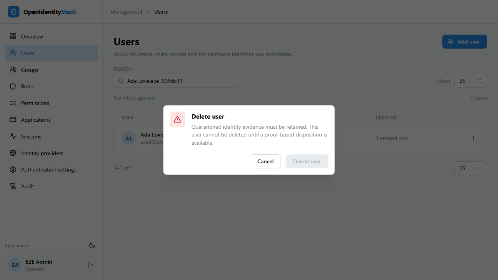

# Quarantined identity migration inventory

Existing federation associations remain stored. An issuer value, matching email, administrative access, or a successful login through a disputed association does not prove that it legitimately belongs to the local account. The migration assigns every pre-existing association `Unknown` evidence, including rows already holding an issuer, and authentication rejects them. New accounts created through validated, collision-free provisioning record `NewAccountProvisioning` evidence. Raw domain linking does not record that evidence.

Operators with `users:read` can inspect the paginated `GET /api/admin/users/identity-migration-inventory` endpoint, optionally filtered by provider ID. Management Web exposes the inventory on a provider's Connection tab and evidence status on each user's Upstream identities tab. Users without this permission cannot retrieve the inventory. Reads do not alter evidence, account status, or authentication state. Pagination is ordered by user ID and is repeatable while records are unchanged; capture a controlled inventory for deployment rather than assuming concurrent changes form one snapshot.

`migrationBlocked` remains true for users with any quarantined association. A configured password is only a candidate credential; it does not establish that the account owner can safely use it. Other active federation providers are listed only when their association evidence and exact issuer binding are established, but independently usable access must still be tested. `recoveryRequired` identifies accounts with no available candidate or local disablement. A false value does not approve migration or prove account control.

Before cutover, inventory affected users and independently test alternative account access with their legitimate owners. Federation-only users with no independently usable alternative cannot migrate until a separately designed proof-based recovery capability is delivered. An emergency administrator provides platform recovery access and cannot prove another user's ownership. Do not reactivate disabled accounts, manufacture evidence, or erase records to clear a blocker.

Ordinary unlink and account deletion reject quarantined associations and audit the denial. Both return HTTP 403 Problem Details with code `Forbidden.UpstreamIdentity.QuarantineRetentionRequired` and explain the retention requirement. The user, association, and unique provider/subject reservation remain stored, so deleting an account cannot release a disputed identity for new provisioning. Management Web checks retention before enabling deletion and keeps confirmation disabled if the check fails or quarantine remains. There is no evidence-state toggle, trust endpoint, or raw identifier update that clears quarantine. New-account evidence and denied authentication are auditable without logging tokens, subjects, or email addresses. A later evidence-based disposition must introduce its own independent proof and audit trail; it is not implemented here.

Back up evidence before deployment. Keep federation disabled during any rollback that would remove the evidence column or restore an authentication path ignoring quarantine. Restoring an older schema does not make old associations trustworthy. Complete issuer-binding, unsafe-linking, local-disablement, credential-cutover and emergency-access work before rollout.

The browser regression verifies that the deletion dialog refuses a quarantined account, sends no deletion request, and leaves the association unchanged. A separate case verifies ordinary account deletion.

