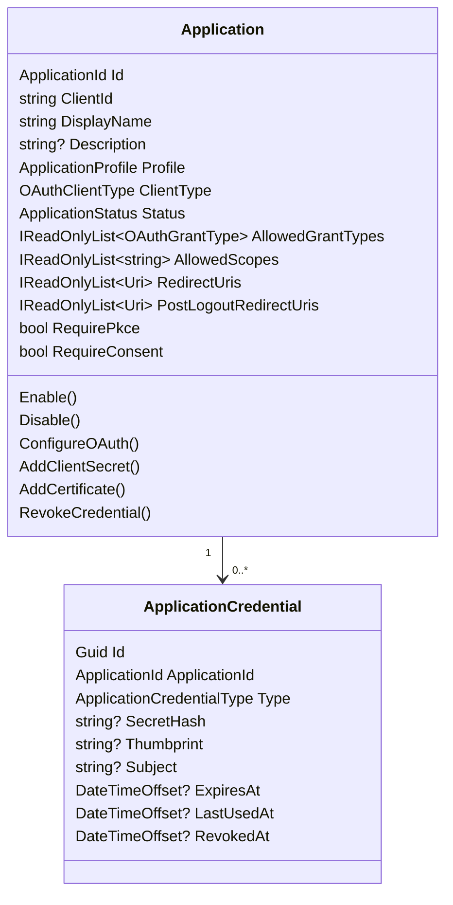

# Feature Specification: Unify Clients and Service Accounts into Applications

**Project**: Open Identity Stack  
**Status**: Proposed  
**Created**: 2026-05-23  
**Target audience**: backend, frontend, persistence, security, and test contributors  
**Primary decision**: replace the separate `Client` and `ServiceAccount` domain concepts with one top-level `Application` aggregate.

## 1. Executive decision

Open Identity Stack should introduce a single first-class domain entity named **Application**.

An `Application` is the administrator-managed registration for software that participates in OAuth 2.0 / OpenID Connect. It owns the protocol `client_id`, allowed grants, allowed scopes, redirect URIs, lifecycle state, client authentication configuration, secrets, certificates, and machine-to-machine behavior.

The current distinction between `Client` and `ServiceAccount` should be removed at the domain level:

| Current concept | New concept | Notes |
| --- | --- | --- |
| `Client` | `Application` | Keep `client_id` as the OAuth protocol identifier. Rename the domain and admin UX concept. |
| `ServiceAccount` | `Application` with `ApplicationProfile = MachineToMachine` | Service-account behavior becomes a capability/profile of an application, not a separate aggregate. |
| `ClientCredential` | `ApplicationCredential` | Used for client secrets and future credential types. |
| `ClientCertificate` | `ApplicationCredential` with `CredentialType = X509Certificate` | Certificates are credentials of an application. |
| `/api/admin/clients` | `/api/admin/applications` | Remove the legacy endpoint in this pre-1.0 breaking change. |
| `/api/admin/service-accounts` | `/api/admin/applications?type=machine-to-machine` | Remove the legacy endpoint in this pre-1.0 breaking change. |
| `Permissions.Clients.*` and `Permissions.ServiceAccounts.*` | `Permissions.Applications.*` | Old permissions should be mapped during migration. |

The preferred public/admin wording is **Application** and **Machine-to-machine application**. The term **client** remains valid only where the OAuth/OIDC protocol uses it, such as `client_id`, `client_secret`, OAuth client authentication, and OpenIddict application descriptors.

## 2. Why this change is needed

### 2.1 Standards alignment

OAuth 2.0 defines the entity that interacts with the authorization server as a **client**, with registration metadata including client type, redirect URIs, and application metadata. The client type is **confidential** or **public**, based on whether the client can keep credentials confidential. The `client_credentials` grant is only appropriate for confidential clients.

The more natural product/domain abstraction for an IAM product is **Application**: the admin registers an application, and the OAuth client details are part of that registration.

### 2.2 Vendor/product alignment

Common IAM products expose “Applications” or “App registrations” and then classify those applications into profiles such as regular web apps, SPAs, native apps, and machine-to-machine apps. Keycloak does still use the protocol term “client,” but its service-account capability is attached to an OIDC client rather than modeled as an unrelated top-level registration.

### 2.3 Current code inconsistency

The current implementation has two aggregate roots that both represent OAuth clients:

- `OpenIdentityStack.Domain.Clients.Client` already represents an “OAuth2/OIDC client application” and owns `ClientIdValue`, `ClientType`, redirect URIs, scopes, grant types, PKCE, and consent.
- `OpenIdentityStack.Domain.ServiceAccounts.ServiceAccount` represents a “machine client” but also owns `ClientId`, scopes, grant types, credentials, certificates, and lifecycle status.
- The service-account aggregate currently accepts grant types beyond `client_credentials`, but the OpenIddict service-account registrar rejects anything except `client_credentials`.
- Service-account secret rotation updates the service-account credential store but does not obviously synchronize the OpenIddict application registration. This creates a projection-consistency risk.

The new model removes the duplicate concept and makes the OAuth/OpenIddict registration a projection of the domain `Application`.

## 3. Research summary

### 3.1 OAuth/OIDC standards

The following standards shape the model:

- OAuth 2.0 client registration metadata includes the client type, redirection URIs, and application name/contact/description-style metadata.
- OAuth 2.0 distinguishes **confidential** and **public** clients according to the ability to maintain client credential confidentiality.
- The OAuth 2.0 `client_credentials` grant is only valid for confidential clients and is used when the client accesses resources under its own control or by pre-arranged authorization.
- OpenID Connect Dynamic Client Registration also describes client metadata such as redirect URIs, response types, grant types, client name, logo URI, and policy/terms URLs.
- OAuth 2.0 Security Best Current Practice deprecates insecure legacy patterns and recommends exact redirect matching, PKCE for authorization code clients, avoiding the implicit grant for new clients, and stronger refresh-token protections.
- OAuth 2.0 Mutual-TLS Client Authentication defines certificate-based client authentication, which fits naturally as an application credential type.

### 3.2 Product patterns

Observed product patterns:

- Auth0 exposes **Applications** and classifies them into Machine to Machine, Native App, Regular Web App, and Single Page App.
- Microsoft Entra ID exposes **App registrations** / application objects, with app/client IDs, secrets, certificates, scopes, and service principals.
- Keycloak exposes OIDC clients and treats a service account as built into a client, not as a separate application registration.
- OpenIddict itself speaks in terms of **client applications** and application permissions for endpoints, grants, scopes, and response types.

### 3.3 Consequence for Open Identity Stack

Open Identity Stack should keep the OAuth protocol vocabulary internally where required, but its domain and admin vocabulary should be:

```text
Application
  ├─ OAuth client identity: client_id
  ├─ Client classification: public/confidential
  ├─ Application profile/profile: web, SPA, native, machine-to-machine, device, custom
  ├─ Allowed OAuth behavior: grants, scopes, redirects, PKCE, consent
  ├─ Credentials: secrets, certificates, future private_key_jwt/JWK
  └─ Lifecycle: active, disabled, deleted/archived
```

## 4. Problem statement

Administrators currently have to decide whether to create a `Client` or a `ServiceAccount`. This is a leaky product distinction because both represent OAuth clients and both ultimately map to OpenIddict applications.

The split causes these problems:

1. **Duplicated aggregate responsibilities**: both objects own `client_id`, display name, scopes, grant types, and registration behavior.
2. **Inconsistent invariants**: service accounts accept more grant types than their registrar supports.
3. **Split credential model**: clients currently get at most one generated secret at creation, while service accounts have richer credential/certificate rotation.
4. **Split OpenIddict synchronization**: client creation and service-account creation use different paths to create OpenIddict applications.
5. **Split permissions and admin UX**: administrators need separate permissions and pages for entities that are conceptually one application registration.
6. **Difficult future extension**: adding private-key JWT, mTLS, DPoP, dynamic registration, or client secret rotation would have to be duplicated or arbitrarily assigned to one side.

## 5. Goals and non-goals

### 5.1 Goals

- Introduce `Application` as the single domain aggregate for OAuth/OIDC application registrations.
- Preserve the protocol term `client_id` and the OAuth distinction between public and confidential clients.
- Model machine-to-machine access as an application profile/capability.
- Move client secrets and certificates under application credentials.
- Generalize service-account validation into application client-authentication validation.
- Provide a migration path from `Clients`, `ServiceAccounts`, `ClientCredentials`, and `ClientCertificates` to the new schema.
- Align with current OAuth 2.0 security best practices.
- Keep OpenIddict as an infrastructure adapter/projection, not the source of truth for domain rules.

### 5.2 Non-goals

- Implement OAuth Dynamic Client Registration in this feature.
- Implement SAML applications in this feature.
- Implement SCIM provisioning applications in this feature.
- Implement delegated customer-tenant service-principal objects in this feature.
- Rework user, role, group, session, or upstream provider domain models except where permissions reference applications.
- Preserve `ServiceAccount` as a top-level domain aggregate.

## 6. Ubiquitous language

| Term | Meaning |
| --- | --- |
| Application | A registered software system that can participate in OAuth/OIDC flows. This is the new aggregate root. |
| OAuth client | Protocol-level term for the application interacting with the authorization server. Use this term in protocol-specific code only. |
| `client_id` | Stable OAuth/OIDC identifier for an application. Must remain externally visible and unique. |
| Public application | Application that cannot keep client credentials confidential, such as SPA/native/device clients. |
| Confidential application | Application that can keep credentials confidential, such as server-side web apps and machine-to-machine apps. |
| Machine-to-machine application | Confidential application using `client_credentials` to obtain tokens for itself. Replaces service account as a top-level concept. |
| Application credential | Secret, certificate, or future assertion credential used to authenticate a confidential application. |
| Application profile/type | Product classification that provides safe defaults and validation rules. |
| OpenIddict application | Infrastructure projection used by OpenIddict. It must be synchronized from the domain application. |
| Service account | Deprecated product term. May appear only when explaining migration from old data. |

## 7. Proposed domain model



### 7.1 Aggregate boundary

`Application` is the aggregate root. Credentials and certificates are child entities. The aggregate enforces:

- application status;
- uniqueness-independent validation of `client_id` shape;
- OAuth grant/profile invariants;
- redirect URI invariants;
- PKCE/consent invariants;
- credential lifecycle invariants;
- domain events for application and credential changes.

Repository-level or database-level constraints enforce uniqueness of `client_id`.

### 7.2 Recommended enums

```csharp
namespace OpenIdentityStack.Domain.Applications;

public enum ApplicationProfile
{
    MachineToMachine = 1,
    Web = 2,
    SinglePage = 3,
    Native = 4,
    Device = 5,
    Custom = 99
}

public enum OAuthClientType
{
    Public = 1,
    Confidential = 2
}

public enum ApplicationStatus
{
    Active = 1,
    Disabled = 2
}

public enum ApplicationCredentialType
{
    ClientSecret = 1,
    X509Certificate = 2,
    PrivateKeyJwt = 3
}

public enum OAuthGrantType
{
    AuthorizationCode = 1,
    ClientCredentials = 2,
    RefreshToken = 3,
    DeviceCode = 4,
    Password = 5,
    Implicit = 6
}
```

### 7.3 Application profiles

| Application profile | Client type | Default grants | Redirects | Credentials | PKCE | Consent |
| --- | --- | --- | --- | --- | --- | --- |
| Machine-to-machine | Confidential | `client_credentials` | Not allowed | Required: secret, certificate, or future assertion | Not applicable | Not applicable / false |
| Web | Confidential | `authorization_code`, optional `refresh_token` | Required for auth code | Secret/certificate/assertion allowed | Recommended; may be required by policy | Configurable |
| Single-page app | Public | `authorization_code`, optional constrained `refresh_token` | Required | Not allowed | Required | Configurable |
| Native | Public | `authorization_code`, optional constrained `refresh_token` | Required | Not allowed | Required | Configurable |
| Device | Public | `urn:ietf:params:oauth:grant-type:device_code` | Not required | Not allowed | Not applicable | Configurable |
| Custom | Explicit | Explicit | Explicit | Explicit | Explicit | Explicit |

`ApplicationProfile.Custom` should be reserved for advanced cases and require explicit grants/validations. It should not be the default.

## 8. Domain invariants

### 8.1 Global application invariants

- `ClientId` is required, trimmed, unique, immutable after creation, and externally stable.
- `ClientId` length should use one unified limit. Recommended: 255 characters, matching the existing `Clients` table.
- `DisplayName` is required and trimmed.
- `DisplayName` length should use one unified limit. Recommended: 255 characters.
- `Description` is optional. Recommended max length: 1000 characters.
- `AllowedScopes` must not contain null/empty/whitespace values.
- `AllowedGrantTypes` must not be empty unless the application is disabled and in migration-review state.
- `Status = Disabled` prevents new token issuance but preserves the registration and credentials.
- Deleted applications should either be hard-deleted consistently from the domain and OpenIddict projection or soft-deleted if audit/regulatory requirements demand it. This spec recommends hard delete for parity with current APIs, with audit log retention.

### 8.2 Grant/client-type invariants

- `client_credentials` requires `OAuthClientType.Confidential`.
- `authorization_code` requires at least one redirect URI.
- `authorization_code` on public applications requires PKCE.
- Public applications must not have client secrets or private client credentials.
- Machine-to-machine applications must be confidential.
- Machine-to-machine applications may only use `client_credentials` in the first implementation.
- Machine-to-machine applications must not have redirect URIs or post-logout redirect URIs.
- `implicit` must be rejected for new applications unless an explicit legacy feature flag is enabled.
- `password` must be rejected for new applications unless an explicit legacy feature flag is enabled.
- `refresh_token` may only be enabled with another primary grant that can issue refresh tokens.
- `device_code` should be allowed only for `ApplicationProfile.Device` or `Custom`.

### 8.3 Redirect URI invariants

- Redirect URIs and post-logout redirect URIs must be absolute URIs.
- Redirect URIs must use exact matching in the authorization flow.
- Wildcard redirect URIs are forbidden by default.
- `http://localhost` and loopback redirect URIs are allowed only for local development/native-client policies.
- Custom URI schemes are allowed only for native apps and must be explicitly validated.
- SPA redirect URIs should be HTTPS in production.

### 8.4 Credential invariants

- A confidential application may have multiple credentials to support rotation.
- Client secrets are returned only once at creation/rotation.
- Client secrets are stored only as hashes in the domain store.
- A credential can be active, expired, or revoked.
- Revoked credentials are never accepted.
- Expired credentials are never accepted.
- Credential usage updates `LastUsedAt`.
- Certificate thumbprints must be unique per active application.
- Certificate credentials must store enough metadata for admin review: thumbprint, subject, expiration, created timestamp, revoked timestamp.

## 9. Complete domain code sample

The following code sample shows the intended domain shape. It is intentionally compact but complete enough to guide implementation in the existing `SharedKernel.Result`, `AggregateRoot<TId>`, and `IDateTimeProvider` style.

```csharp
using OpenIdentityStack.Domain.Common;
using SharedKernel;

namespace OpenIdentityStack.Domain.Applications;

public sealed record ApplicationId(Guid Value)
{
    public static ApplicationId NewId() => new(Guid.NewGuid());
}

public enum ApplicationProfile
{
    MachineToMachine = 1,
    Web = 2,
    SinglePage = 3,
    Native = 4,
    Device = 5,
    Custom = 99
}

public enum OAuthClientType
{
    Public = 1,
    Confidential = 2
}

public enum ApplicationStatus
{
    Active = 1,
    Disabled = 2
}

public enum ApplicationCredentialType
{
    ClientSecret = 1,
    X509Certificate = 2,
    PrivateKeyJwt = 3
}

public static class OAuthGrantTypes
{
    public const string AuthorizationCode = "authorization_code";
    public const string ClientCredentials = "client_credentials";
    public const string RefreshToken = "refresh_token";
    public const string DeviceCode = "urn:ietf:params:oauth:grant-type:device_code";
    public const string Password = "password";
    public const string Implicit = "implicit";
}

public sealed class Application : AggregateRoot<ApplicationId>
{
    private readonly List<string> redirectUris = [];
    private readonly List<string> postLogoutRedirectUris = [];
    private readonly List<string> allowedScopes = [];
    private readonly List<string> allowedGrantTypes = [];
    private readonly List<ApplicationCredential> credentials = [];

    public string ClientId { get; private set; } = string.Empty;
    public string DisplayName { get; private set; } = string.Empty;
    public string? Description { get; private set; }
    public ApplicationProfile Profile { get; private set; }
    public OAuthClientType ClientType { get; private set; }
    public ApplicationStatus Status { get; private set; }
    public bool RequirePkce { get; private set; }
    public bool RequireConsent { get; private set; }

    public IReadOnlyList<string> RedirectUris => this.redirectUris.AsReadOnly();
    public IReadOnlyList<string> PostLogoutRedirectUris => this.postLogoutRedirectUris.AsReadOnly();
    public IReadOnlyList<string> AllowedScopes => this.allowedScopes.AsReadOnly();
    public IReadOnlyList<string> AllowedGrantTypes => this.allowedGrantTypes.AsReadOnly();
    public IReadOnlyList<ApplicationCredential> Credentials => this.credentials.AsReadOnly();

    private Application() : base()
    {
    }

    private Application(
        ApplicationId id,
        string clientId,
        string displayName,
        string? description,
        ApplicationProfile profile,
        OAuthClientType clientType,
        IReadOnlyList<string> redirectUris,
        IReadOnlyList<string> postLogoutRedirectUris,
        IReadOnlyList<string> allowedScopes,
        IReadOnlyList<string> allowedGrantTypes,
        bool requirePkce,
        bool requireConsent,
        DateTimeOffset createdAt) : base(id)
    {
        this.ClientId = clientId;
        this.DisplayName = displayName;
        this.Description = description;
        this.Profile = type;
        this.ClientType = clientType;
        this.Status = ApplicationStatus.Active;
        this.redirectUris.AddRange(redirectUris);
        this.postLogoutRedirectUris.AddRange(postLogoutRedirectUris);
        this.allowedScopes.AddRange(allowedScopes);
        this.allowedGrantTypes.AddRange(allowedGrantTypes);
        this.RequirePkce = requirePkce;
        this.RequireConsent = requireConsent;
        this.CreatedAt = createdAt;
        this.SetModified(createdAt);
    }

    public static Result<Application> Create(
        string clientId,
        string displayName,
        string? description,
        ApplicationProfile profile,
        OAuthClientType clientType,
        IReadOnlyList<string> redirectUris,
        IReadOnlyList<string> postLogoutRedirectUris,
        IReadOnlyList<string> allowedScopes,
        IReadOnlyList<string> allowedGrantTypes,
        bool requirePkce,
        bool requireConsent,
        IDateTimeProvider dateTimeProvider)
    {
        Result validation = ValidateConfiguration(
            clientId,
            displayName,
            description,
            type,
            clientType,
            redirectUris,
            postLogoutRedirectUris,
            allowedScopes,
            allowedGrantTypes,
            requirePkce,
            requireConsent);

        if (validation.IsFailure)
        {
            return validation.Error;
        }

        var application = new Application(
            ApplicationId.NewId(),
            clientId.Trim(),
            displayName.Trim(),
            string.IsNullOrWhiteSpace(description) ? null : description.Trim(),
            type,
            clientType,
            redirectUris.Select(uri => uri.Trim()).Distinct(StringComparer.OrdinalIgnoreCase).ToArray(),
            postLogoutRedirectUris.Select(uri => uri.Trim()).Distinct(StringComparer.OrdinalIgnoreCase).ToArray(),
            allowedScopes.Select(scope => scope.Trim()).Distinct(StringComparer.Ordinal).ToArray(),
            allowedGrantTypes.Select(grant => grant.Trim()).Distinct(StringComparer.Ordinal).ToArray(),
            requirePkce || clientType == OAuthClientType.Public,
            requireConsent,
            dateTimeProvider.UtcNow);

        application.RaiseDomainEvent(new ApplicationDomainEvents.ApplicationCreated(
            application.Id,
            application.ClientId,
            application.DisplayName,
            application.Profile,
            dateTimeProvider.UtcNow));

        return application;
    }

    public Result UpdateMetadata(string displayName, string? description, IDateTimeProvider dateTimeProvider)
    {
        if (string.IsNullOrWhiteSpace(displayName))
        {
            return ApplicationErrors.DisplayNameRequired;
        }

        if (displayName.Length > 255)
        {
            return ApplicationErrors.DisplayNameTooLong;
        }

        this.DisplayName = displayName.Trim();
        this.Description = string.IsNullOrWhiteSpace(description) ? null : description.Trim();
        this.SetModified(dateTimeProvider.UtcNow);

        this.RaiseDomainEvent(new ApplicationDomainEvents.ApplicationUpdated(this.Id, dateTimeProvider.UtcNow));
        return Result.Success();
    }

    public Result ConfigureOAuth(
        ApplicationProfile profile,
        OAuthClientType clientType,
        IReadOnlyList<string> redirectUris,
        IReadOnlyList<string> postLogoutRedirectUris,
        IReadOnlyList<string> allowedScopes,
        IReadOnlyList<string> allowedGrantTypes,
        bool requirePkce,
        bool requireConsent,
        IDateTimeProvider dateTimeProvider)
    {
        Result validation = ValidateConfiguration(
            this.ClientId,
            this.DisplayName,
            this.Description,
            type,
            clientType,
            redirectUris,
            postLogoutRedirectUris,
            allowedScopes,
            allowedGrantTypes,
            requirePkce,
            requireConsent);

        if (validation.IsFailure)
        {
            return validation.Error;
        }

        this.Profile = type;
        this.ClientType = clientType;
        this.redirectUris.Clear();
        this.redirectUris.AddRange(redirectUris.Select(uri => uri.Trim()).Distinct(StringComparer.OrdinalIgnoreCase));
        this.postLogoutRedirectUris.Clear();
        this.postLogoutRedirectUris.AddRange(postLogoutRedirectUris.Select(uri => uri.Trim()).Distinct(StringComparer.OrdinalIgnoreCase));
        this.allowedScopes.Clear();
        this.allowedScopes.AddRange(allowedScopes.Select(scope => scope.Trim()).Distinct(StringComparer.Ordinal));
        this.allowedGrantTypes.Clear();
        this.allowedGrantTypes.AddRange(allowedGrantTypes.Select(grant => grant.Trim()).Distinct(StringComparer.Ordinal));
        this.RequirePkce = requirePkce || clientType == OAuthClientType.Public;
        this.RequireConsent = requireConsent;
        this.SetModified(dateTimeProvider.UtcNow);

        this.RaiseDomainEvent(new ApplicationDomainEvents.ApplicationOAuthConfigurationChanged(this.Id, dateTimeProvider.UtcNow));
        return Result.Success();
    }

    public Result Disable(IDateTimeProvider dateTimeProvider)
    {
        if (this.Status == ApplicationStatus.Disabled)
        {
            return ApplicationErrors.AlreadyDisabled;
        }

        this.Status = ApplicationStatus.Disabled;
        this.SetModified(dateTimeProvider.UtcNow);
        this.RaiseDomainEvent(new ApplicationDomainEvents.ApplicationDisabled(this.Id, dateTimeProvider.UtcNow));
        return Result.Success();
    }

    public Result Enable(IDateTimeProvider dateTimeProvider)
    {
        if (this.Status == ApplicationStatus.Active)
        {
            return ApplicationErrors.AlreadyActive;
        }

        this.Status = ApplicationStatus.Active;
        this.SetModified(dateTimeProvider.UtcNow);
        this.RaiseDomainEvent(new ApplicationDomainEvents.ApplicationEnabled(this.Id, dateTimeProvider.UtcNow));
        return Result.Success();
    }

    public Result<Guid> AddClientSecret(
        string secretHash,
        string? description,
        DateTimeOffset? expiresAt,
        IDateTimeProvider dateTimeProvider)
    {
        if (this.ClientType != OAuthClientType.Confidential)
        {
            return ApplicationErrors.PublicApplicationsCannotHaveSecrets;
        }

        var credential = ApplicationCredential.CreateClientSecret(
            this.Id,
            secretHash,
            description,
            expiresAt,
            dateTimeProvider.UtcNow);

        this.credentials.Add(credential);
        this.SetModified(dateTimeProvider.UtcNow);
        this.RaiseDomainEvent(new ApplicationDomainEvents.ApplicationCredentialAdded(
            this.Id,
            credential.Id,
            ApplicationCredentialType.ClientSecret,
            dateTimeProvider.UtcNow));

        return credential.Id;
    }

    public Result<Guid> AddCertificate(
        string thumbprint,
        string subject,
        DateTimeOffset expiresAt,
        IDateTimeProvider dateTimeProvider)
    {
        if (this.ClientType != OAuthClientType.Confidential)
        {
            return ApplicationErrors.PublicApplicationsCannotHaveCertificates;
        }

        if (this.credentials.Any(c => c.Type == ApplicationCredentialType.X509Certificate &&
                                      c.Thumbprint == thumbprint &&
                                      !c.IsRevoked &&
                                      !c.IsExpired(dateTimeProvider.UtcNow)))
        {
            return ApplicationErrors.CertificateAlreadyRegistered;
        }

        var credential = ApplicationCredential.CreateCertificate(
            this.Id,
            thumbprint,
            subject,
            expiresAt,
            dateTimeProvider.UtcNow);

        this.credentials.Add(credential);
        this.SetModified(dateTimeProvider.UtcNow);
        this.RaiseDomainEvent(new ApplicationDomainEvents.ApplicationCredentialAdded(
            this.Id,
            credential.Id,
            ApplicationCredentialType.X509Certificate,
            dateTimeProvider.UtcNow));

        return credential.Id;
    }

    public Result RevokeCredential(Guid credentialId, IDateTimeProvider dateTimeProvider)
    {
        ApplicationCredential? credential = this.credentials.FirstOrDefault(c => c.Id == credentialId);
        if (credential is null)
        {
            return ApplicationErrors.CredentialNotFound;
        }

        credential.Revoke(dateTimeProvider.UtcNow);
        this.SetModified(dateTimeProvider.UtcNow);
        this.RaiseDomainEvent(new ApplicationDomainEvents.ApplicationCredentialRevoked(
            this.Id,
            credentialId,
            dateTimeProvider.UtcNow));

        return Result.Success();
    }

    private static Result ValidateConfiguration(
        string clientId,
        string displayName,
        string? description,
        ApplicationProfile profile,
        OAuthClientType clientType,
        IReadOnlyList<string> redirectUris,
        IReadOnlyList<string> postLogoutRedirectUris,
        IReadOnlyList<string> allowedScopes,
        IReadOnlyList<string> allowedGrantTypes,
        bool requirePkce,
        bool requireConsent)
    {
        if (string.IsNullOrWhiteSpace(clientId))
        {
            return ApplicationErrors.ClientIdRequired;
        }

        if (clientId.Length > 255)
        {
            return ApplicationErrors.ClientIdTooLong;
        }

        if (string.IsNullOrWhiteSpace(displayName))
        {
            return ApplicationErrors.DisplayNameRequired;
        }

        if (displayName.Length > 255)
        {
            return ApplicationErrors.DisplayNameTooLong;
        }

        if (description?.Length > 1000)
        {
            return ApplicationErrors.DescriptionTooLong;
        }

        if (allowedGrantTypes.Count == 0)
        {
            return ApplicationErrors.GrantTypesRequired;
        }

        if (allowedScopes.Any(string.IsNullOrWhiteSpace))
        {
            return ApplicationErrors.InvalidScope;
        }

        if (allowedGrantTypes.Any(string.IsNullOrWhiteSpace))
        {
            return ApplicationErrors.InvalidGrantType;
        }

        foreach (string uri in redirectUris.Concat(postLogoutRedirectUris))
        {
            if (!Uri.TryCreate(uri, UriKind.Absolute, out _))
            {
                return ApplicationErrors.InvalidRedirectUri;
            }
        }

        bool hasClientCredentials = allowedGrantTypes.Contains(OAuthGrantTypes.ClientCredentials, StringComparer.Ordinal);
        bool hasAuthorizationCode = allowedGrantTypes.Contains(OAuthGrantTypes.AuthorizationCode, StringComparer.Ordinal);
        bool hasImplicit = allowedGrantTypes.Contains(OAuthGrantTypes.Implicit, StringComparer.Ordinal);
        bool hasPassword = allowedGrantTypes.Contains(OAuthGrantTypes.Password, StringComparer.Ordinal);
        bool hasDeviceCode = allowedGrantTypes.Contains(OAuthGrantTypes.DeviceCode, StringComparer.Ordinal);

        if (hasImplicit)
        {
            return ApplicationErrors.ImplicitGrantNotAllowedForNewApplications;
        }

        if (hasPassword)
        {
            return ApplicationErrors.PasswordGrantNotAllowedForNewApplications;
        }

        if (hasClientCredentials && clientType != OAuthClientType.Confidential)
        {
            return ApplicationErrors.ClientCredentialsRequiresConfidentialClient;
        }

        if (hasAuthorizationCode && redirectUris.Count == 0)
        {
            return ApplicationErrors.RedirectUriRequired;
        }

        if (clientType == OAuthClientType.Public && hasAuthorizationCode && !requirePkce)
        {
            return ApplicationErrors.PkceRequiredForPublicAuthorizationCodeApplications;
        }

        if (type == ApplicationProfile.MachineToMachine)
        {
            if (clientType != OAuthClientType.Confidential)
            {
                return ApplicationErrors.MachineToMachineRequiresConfidentialClient;
            }

            if (allowedGrantTypes.Count != 1 || !hasClientCredentials)
            {
                return ApplicationErrors.MachineToMachineOnlySupportsClientCredentials;
            }

            if (redirectUris.Count > 0 || postLogoutRedirectUris.Count > 0 || requireConsent)
            {
                return ApplicationErrors.MachineToMachineCannotUseInteractiveSettings;
            }
        }

        if (type == ApplicationProfile.Device && !hasDeviceCode)
        {
            return ApplicationErrors.DeviceApplicationsRequireDeviceCodeGrant;
        }

        return Result.Success();
    }
}

public sealed class ApplicationCredential : IEquatable<ApplicationCredential>
{
    public Guid Id { get; private set; }
    public ApplicationId ApplicationId { get; private set; }
    public ApplicationCredentialType Type { get; private set; }
    public string? SecretHash { get; private set; }
    public string? Thumbprint { get; private set; }
    public string? Subject { get; private set; }
    public string? Description { get; private set; }
    public DateTimeOffset? ExpiresAt { get; private set; }
    public DateTimeOffset CreatedAt { get; private set; }
    public DateTimeOffset? LastUsedAt { get; private set; }
    public DateTimeOffset? RevokedAt { get; private set; }
    public bool IsRevoked => this.RevokedAt.HasValue;

    private ApplicationCredential()
    {
    }

    private ApplicationCredential(
        Guid id,
        ApplicationId applicationId,
        ApplicationCredentialType type,
        string? secretHash,
        string? thumbprint,
        string? subject,
        string? description,
        DateTimeOffset? expiresAt,
        DateTimeOffset createdAt)
    {
        this.Id = id;
        this.ApplicationId = applicationId;
        this.Profile = type;
        this.SecretHash = secretHash;
        this.Thumbprint = thumbprint;
        this.Subject = subject;
        this.Description = description;
        this.ExpiresAt = expiresAt;
        this.CreatedAt = createdAt;
    }

    public static ApplicationCredential CreateClientSecret(
        ApplicationId applicationId,
        string secretHash,
        string? description,
        DateTimeOffset? expiresAt,
        DateTimeOffset createdAt) =>
        new(
            Guid.NewGuid(),
            applicationId,
            ApplicationCredentialType.ClientSecret,
            secretHash,
            thumbprint: null,
            subject: null,
            description,
            expiresAt,
            createdAt);

    public static ApplicationCredential CreateCertificate(
        ApplicationId applicationId,
        string thumbprint,
        string subject,
        DateTimeOffset expiresAt,
        DateTimeOffset createdAt) =>
        new(
            Guid.NewGuid(),
            applicationId,
            ApplicationCredentialType.X509Certificate,
            secretHash: null,
            thumbprint,
            subject,
            description: subject,
            expiresAt,
            createdAt);

    public bool IsExpired(DateTimeOffset asOf) => this.ExpiresAt.HasValue && asOf >= this.ExpiresAt.Value;

    public bool IsValid(DateTimeOffset asOf) => !this.IsRevoked && !this.IsExpired(asOf);

    internal void Revoke(DateTimeOffset revokedAt)
    {
        this.RevokedAt ??= revokedAt;
    }

    internal void RecordUsage(DateTimeOffset usedAt)
    {
        this.LastUsedAt = usedAt;
    }

    public bool Equals(ApplicationCredential? other) => other is not null && this.Id == other.Id;

    public override bool Equals(object? obj) => this.Equals(obj as ApplicationCredential);

    public override int GetHashCode() => this.Id.GetHashCode();
}
```

## 10. Application use cases

### 10.1 Commands

| Use case | Purpose |
| --- | --- |
| `CreateApplicationUseCase` | Creates any application profile and optionally one initial credential. |
| `UpdateApplicationMetadataUseCase` | Updates display name and description. |
| `ConfigureApplicationOAuthUseCase` | Updates grants, scopes, redirects, PKCE, consent, and type/profile. |
| `EnableApplicationUseCase` | Reactivates disabled application. |
| `DisableApplicationUseCase` | Prevents new token issuance while preserving configuration. |
| `DeleteApplicationUseCase` | Deletes application and OpenIddict projection. |
| `AddApplicationSecretUseCase` | Adds a new client secret, returns plain value once. |
| `RevokeApplicationCredentialUseCase` | Revokes a credential. |
| `AddApplicationCertificateUseCase` | Adds an X.509 certificate credential. |
| `ValidateApplicationClientCredentialsUseCase` | Validates secret authentication for confidential applications. |
| `ValidateApplicationCertificateUseCase` | Validates mTLS certificate authentication. |

### 10.2 Queries

| Query | Purpose |
| --- | --- |
| `GetApplicationQueryHandler` | Returns full application details. |
| `ListApplicationsQueryHandler` | Paged list with filters: type, client type, status, search. |
| `ListApplicationCredentialsQueryHandler` | Lists credential metadata without secret hashes. |
| `GetApplicationByClientIdQueryHandler` | Used by token validation and admin diagnostics. |

## 11. API contract

### 11.1 Endpoint design

Base route: `/api/admin/applications`

| Method | Route | Permission | Purpose |
| --- | --- | --- | --- |
| `POST` | `/api/admin/applications` | `applications:write` | Create application. |
| `GET` | `/api/admin/applications/{id:guid}` | `applications:read` | Get application. |
| `GET` | `/api/admin/applications` | `applications:read` | List applications. |
| `PATCH` | `/api/admin/applications/{id:guid}` | `applications:write` | Update metadata. |
| `PUT` | `/api/admin/applications/{id:guid}/oauth` | `applications:write` | Replace OAuth configuration. |
| `POST` | `/api/admin/applications/{id:guid}/disable` | `applications:write` | Disable application. |
| `POST` | `/api/admin/applications/{id:guid}/enable` | `applications:write` | Enable application. |
| `DELETE` | `/api/admin/applications/{id:guid}` | `applications:delete` | Delete application. |
| `POST` | `/api/admin/applications/{id:guid}/credentials/client-secrets` | `applications:manage-credentials` | Add or rotate client secret. |
| `POST` | `/api/admin/applications/{id:guid}/credentials/certificates` | `applications:manage-certificates` | Add certificate. |
| `DELETE` | `/api/admin/applications/{id:guid}/credentials/{credentialId:guid}` | `applications:manage-credentials` | Revoke credential. |

### 11.2 Complete API DTO sample

```csharp
using OpenIdentityStack.Domain.Applications;

namespace OpenIdentityStack.Api.Applications;

public sealed record CreateApplicationRequest(
    string ClientId,
    string DisplayName,
    string? Description,
    ApplicationProfile Profile,
    OAuthClientType ClientType,
    IReadOnlyList<string> RedirectUris,
    IReadOnlyList<string> PostLogoutRedirectUris,
    IReadOnlyList<string> AllowedScopes,
    IReadOnlyList<string> AllowedGrantTypes,
    bool RequirePkce,
    bool RequireConsent,
    CreateInitialCredentialRequest? InitialCredential);

public sealed record CreateInitialCredentialRequest(
    ApplicationCredentialType Type,
    string? Description,
    DateTimeOffset? ExpiresAt,
    string? CertificateThumbprint,
    string? CertificateSubject);

public sealed record UpdateApplicationMetadataRequest(
    string DisplayName,
    string? Description);

public sealed record ConfigureApplicationOAuthRequest(
    ApplicationProfile Profile,
    OAuthClientType ClientType,
    IReadOnlyList<string> RedirectUris,
    IReadOnlyList<string> PostLogoutRedirectUris,
    IReadOnlyList<string> AllowedScopes,
    IReadOnlyList<string> AllowedGrantTypes,
    bool RequirePkce,
    bool RequireConsent);

public sealed record AddApplicationSecretRequest(
    string? Description,
    DateTimeOffset? ExpiresAt,
    bool RevokeExisting = false);

public sealed record AddApplicationCertificateRequest(
    string Thumbprint,
    string Subject,
    DateTimeOffset ExpiresAt);

public sealed record ApplicationCreatedResponse(
    Guid Id,
    string ClientId,
    string DisplayName,
    ApplicationProfile Profile,
    OAuthClientType ClientType,
    ApplicationStatus Status,
    string? InitialSecret,
    DateTimeOffset CreatedAt);

public sealed record ApplicationResponse(
    Guid Id,
    string ClientId,
    string DisplayName,
    string? Description,
    ApplicationProfile Profile,
    OAuthClientType ClientType,
    ApplicationStatus Status,
    IReadOnlyList<string> RedirectUris,
    IReadOnlyList<string> PostLogoutRedirectUris,
    IReadOnlyList<string> AllowedScopes,
    IReadOnlyList<string> AllowedGrantTypes,
    bool RequirePkce,
    bool RequireConsent,
    int CredentialCount,
    int CertificateCount,
    DateTimeOffset CreatedAt,
    DateTimeOffset? ModifiedAt);

public sealed record ApplicationCredentialResponse(
    Guid Id,
    ApplicationCredentialType Type,
    string? Description,
    string? Thumbprint,
    string? Subject,
    DateTimeOffset? ExpiresAt,
    DateTimeOffset CreatedAt,
    DateTimeOffset? LastUsedAt,
    DateTimeOffset? RevokedAt);

public sealed record AddApplicationSecretResponse(
    Guid CredentialId,
    string ClientSecret);

public sealed record AddApplicationCertificateResponse(
    Guid CredentialId);

public sealed record ApplicationListItemResponse(
    Guid Id,
    string ClientId,
    string DisplayName,
    ApplicationProfile Profile,
    OAuthClientType ClientType,
    ApplicationStatus Status,
    IReadOnlyList<string> AllowedGrantTypes,
    int CredentialCount,
    DateTimeOffset CreatedAt,
    DateTimeOffset? ModifiedAt);

public sealed record ListApplicationsResponse(
    IReadOnlyList<ApplicationListItemResponse> Items,
    int Page,
    int PageSize,
    int TotalCount,
    int TotalPages,
    bool HasPreviousPage,
    bool HasNextPage);
```

### 11.3 Create request examples

#### Machine-to-machine application

```json
{
  "clientId": "inventory-worker",
  "displayName": "Inventory Worker",
  "description": "Background worker that synchronizes inventory data.",
  "type": "MachineToMachine",
  "clientType": "Confidential",
  "redirectUris": [],
  "postLogoutRedirectUris": [],
  "allowedScopes": ["inventory.read", "inventory.write"],
  "allowedGrantTypes": ["client_credentials"],
  "requirePkce": false,
  "requireConsent": false,
  "initialCredential": {
    "type": "ClientSecret",
    "description": "Initial deployment secret",
    "expiresAt": "2026-11-23T00:00:00Z",
    "certificateThumbprint": null,
    "certificateSubject": null
  }
}
```

#### Regular web application

```json
{
  "clientId": "management-web",
  "displayName": "OpenIdentityStack Management Web",
  "description": "Server-backed admin portal.",
  "type": "Web",
  "clientType": "Confidential",
  "redirectUris": ["https://admin.example.com/signin-oidc"],
  "postLogoutRedirectUris": ["https://admin.example.com/signout-callback-oidc"],
  "allowedScopes": ["openid", "profile", "email"],
  "allowedGrantTypes": ["authorization_code", "refresh_token"],
  "requirePkce": true,
  "requireConsent": false,
  "initialCredential": {
    "type": "ClientSecret",
    "description": "Initial management web secret",
    "expiresAt": "2026-11-23T00:00:00Z",
    "certificateThumbprint": null,
    "certificateSubject": null
  }
}
```

#### Single-page application

```json
{
  "clientId": "patient-portal-spa",
  "displayName": "Patient Portal SPA",
  "description": "Browser-based patient portal frontend.",
  "type": "SinglePage",
  "clientType": "Public",
  "redirectUris": ["https://portal.example.com/auth/callback"],
  "postLogoutRedirectUris": ["https://portal.example.com/"],
  "allowedScopes": ["openid", "profile", "patient.read"],
  "allowedGrantTypes": ["authorization_code"],
  "requirePkce": true,
  "requireConsent": true,
  "initialCredential": null
}
```

## 12. OpenIddict integration

### 12.1 Port

Create an application protocol projection port in the application layer:

```csharp
using OpenIdentityStack.Domain.Applications;
using SharedKernel;

namespace OpenIdentityStack.Application.Abstractions;

public interface IApplicationProtocolProjection
{
    Task<Result> UpsertAsync(Application application, CancellationToken cancellationToken = default);

    Task<Result> DeleteAsync(string clientId, CancellationToken cancellationToken = default);

    Task<Result> DisableAsync(string clientId, CancellationToken cancellationToken = default);
}
```

The infrastructure implementation maps `Application` to `OpenIddictApplicationDescriptor` and updates the OpenIddict application store.

### 12.2 Projection policy

OpenIddict is a protocol projection. The domain application is the source of truth.

When an application is created or its OAuth configuration changes:

1. Validate domain invariants.
2. Persist/update the domain application.
3. Upsert the OpenIddict application descriptor in the same unit of work if possible.
4. Ensure OpenIddict permissions match the domain grants, endpoints, scopes, and response types.
5. Emit audit log and domain events.

Recommended OpenIddict mapping:

| Domain field | OpenIddict descriptor field/permission |
| --- | --- |
| `ClientId` | `ClientId` |
| `DisplayName` | `DisplayName` |
| `OAuthClientType.Confidential` | `ClientType = Confidential` |
| `OAuthClientType.Public` | `ClientType = Public` |
| `RedirectUris` | `RedirectUris` |
| `PostLogoutRedirectUris` | `PostLogoutRedirectUris` |
| `RequireConsent` | `ConsentType = Explicit` when true; otherwise `Implicit` |
| `RequirePkce` | `Requirements.Features.ProofKeyForCodeExchange` |
| `authorization_code` | Authorization endpoint, token endpoint, authorization code grant, code response type |
| `client_credentials` | Token endpoint, client credentials grant |
| `refresh_token` | Token endpoint, refresh token grant |
| custom scopes | `OpenIddictConstants.Permissions.Prefixes.Scope + scope` |
| disabled status | either remove/disable projection or reject in custom validation handler |

### 12.3 Credential ownership decision

Recommended: the domain owns credential hashes and credential lifecycle. OpenIddict remains the application-registration projection.

This requires generalizing the current service-account validation handler into an application client-authentication handler that:

- applies to all confidential applications, not only machine-to-machine applications;
- rejects disabled applications;
- validates active client secrets against `ApplicationCredential.SecretHash`;
- validates active certificates against `ApplicationCredential.Thumbprint`;
- updates `LastUsedAt` for successful credential use;
- rejects revoked and expired credentials;
- avoids split-brain between OpenIddict secrets and domain secrets.

If OpenIddict must keep a client secret for built-in validation, then secret add/revoke operations must synchronously update OpenIddict as well. The implementation must not allow a secret that exists in the domain but is absent from the OpenIddict validation path.

## 13. Persistence design

### 13.1 New tables

#### `Applications`

| Column | Type | Required | Notes |
| --- | ---: | ---: | --- |
| `Id` | `uuid` | yes | New `ApplicationId`. Existing `ClientId`/`ServiceAccountId` values can be preserved where possible. |
| `ClientId` | `text` / varchar(255) | yes | Unique OAuth `client_id`. |
| `DisplayName` | varchar(255) | yes | Unified max length. |
| `Description` | varchar(1000) | no | From current client description, null for service-account migration. |
| `Type` | int | yes | `ApplicationProfile`. |
| `ClientType` | int | yes | Public/confidential. |
| `Status` | int | yes | Active/disabled. |
| `RedirectUris` | jsonb | yes | Empty array when not applicable. |
| `PostLogoutRedirectUris` | jsonb | yes | Empty array when not applicable. |
| `AllowedScopes` | jsonb | yes | Empty array allowed only if policy permits. |
| `AllowedGrantTypes` | jsonb | yes | Must not be empty for active apps. |
| `RequirePkce` | boolean | yes | True for public auth-code apps. |
| `RequireConsent` | boolean | yes | False for machine-to-machine. |
| `RequiresMigrationReview` | boolean | yes | True for ambiguous/legacy migrated rows. |
| `MigrationSource` | varchar(64) | no | `Client`, `ServiceAccount`, or null. |
| `CreatedAt` | timestamptz | yes | Preserve source value. |
| `ModifiedAt` | timestamptz | no | Preserve source value. |

Indexes:

- Unique: `IX_Applications_ClientId`
- Non-unique: `IX_Applications_Type`
- Non-unique: `IX_Applications_Status`
- Non-unique: `IX_Applications_CreatedAt`

#### `ApplicationCredentials`

| Column | Type | Required | Notes |
| --- | ---: | ---: | --- |
| `Id` | `uuid` | yes | Existing credential/certificate id can be preserved. |
| `ApplicationId` | `uuid` | yes | FK to `Applications`. |
| `Type` | int | yes | Secret/certificate/private-key JWT. |
| `SecretHash` | text | no | Present for client secrets only. |
| `Thumbprint` | varchar(128) | no | Present for certificate credentials. |
| `Subject` | varchar(512) | no | Certificate subject or credential subject. |
| `Description` | varchar(512) | no | Admin description. |
| `ExpiresAt` | timestamptz | no | Null means no explicit expiry. |
| `CreatedAt` | timestamptz | yes | Preserve source value. |
| `LastUsedAt` | timestamptz | no | Preserve source value. |
| `RevokedAt` | timestamptz | no | Existing boolean `IsRevoked` maps to migration timestamp if no better value exists. |

Indexes:

- Non-unique: `IX_ApplicationCredentials_ApplicationId`
- Non-unique: `IX_ApplicationCredentials_Type`
- Non-unique: `IX_ApplicationCredentials_ExpiresAt`
- Optional filtered unique index: active certificate thumbprint per application.

## 15. Permissions and authorization

Replace the split permission namespaces with one application namespace.

```csharp
namespace OpenIdentityStack.Application.Authorization;

public static partial class Permissions
{
    public static class Applications
    {
        public const string Read = "applications:read";
        public const string Write = "applications:write";
        public const string Delete = "applications:delete";
        public const string ManageCredentials = "applications:manage-credentials";
        public const string ManageCertificates = "applications:manage-certificates";
        public const string All = "applications:*";
    }
}
```

Migration mapping:

| Existing permission | New permission |
| --- | --- |
| `clients:read` | `applications:read` |
| `clients:write` | `applications:write` |
| `clients:delete` | `applications:delete` |
| `clients:manage-secrets` | `applications:manage-credentials` |
| `service-accounts:read` | `applications:read` |
| `service-accounts:write` | `applications:write` |
| `service-accounts:delete` | `applications:delete` |
| `service-accounts:rotate-secret` | `applications:manage-credentials` |
| `service-accounts:manage-certificates` | `applications:manage-certificates` |
| `clients:*` or `service-accounts:*` | `applications:*` |

Old permissions are migration inputs only. Runtime authorization should use only `applications:*` permissions after the breaking change.

## 16. Events and audit

### 16.1 Domain events

Recommended domain events:

```csharp
namespace OpenIdentityStack.Domain.Applications;

public static class ApplicationDomainEvents
{
    public sealed record ApplicationCreated(
        ApplicationId ApplicationId,
        string ClientId,
        string DisplayName,
        ApplicationProfile Profile,
        DateTimeOffset OccurredAt) : DomainEvent(OccurredAt);

    public sealed record ApplicationUpdated(
        ApplicationId ApplicationId,
        DateTimeOffset OccurredAt) : DomainEvent(OccurredAt);

    public sealed record ApplicationOAuthConfigurationChanged(
        ApplicationId ApplicationId,
        DateTimeOffset OccurredAt) : DomainEvent(OccurredAt);

    public sealed record ApplicationEnabled(
        ApplicationId ApplicationId,
        DateTimeOffset OccurredAt) : DomainEvent(OccurredAt);

    public sealed record ApplicationDisabled(
        ApplicationId ApplicationId,
        DateTimeOffset OccurredAt) : DomainEvent(OccurredAt);

    public sealed record ApplicationCredentialAdded(
        ApplicationId ApplicationId,
        Guid CredentialId,
        ApplicationCredentialType CredentialType,
        DateTimeOffset OccurredAt) : DomainEvent(OccurredAt);

    public sealed record ApplicationCredentialRevoked(
        ApplicationId ApplicationId,
        Guid CredentialId,
        DateTimeOffset OccurredAt) : DomainEvent(OccurredAt);

    public sealed record ApplicationCredentialUsed(
        ApplicationId ApplicationId,
        Guid CredentialId,
        DateTimeOffset OccurredAt) : DomainEvent(OccurredAt);
}
```

### 16.2 Audit events

Recommended audit action names:

- `Application.Created`
- `Application.Updated`
- `Application.OAuthConfigurationChanged`
- `Application.Enabled`
- `Application.Disabled`
- `Application.Deleted`
- `Application.SecretAdded`
- `Application.CredentialRevoked`
- `Application.CertificateAdded`

Audit details must not include plain client secrets or secret hashes.

## 17. Admin UI changes

### 17.1 Navigation

Replace separate navigation entries:

- Clients
- Service Accounts

with:

- Applications

The Applications page should provide filters:

- Type: Machine-to-machine, Web, Single-page, Native, Device, Custom
- Status: Active, Disabled
- Client type: Public, Confidential
- Search: client id, display name

### 17.2 Create flow

Use an application-profile-first wizard:

1. Choose application profile.
2. Enter `client_id`, display name, and description.
3. Configure redirect URIs when required.
4. Configure scopes and grants using safe defaults.
5. Configure credentials if confidential.
6. Show generated secret once.

### 17.3 Detail page tabs

Recommended tabs:

- Overview
- OAuth configuration
- Credentials
- Certificates
- Permissions / Scopes
- Audit

### 17.4 Terminology

Use UI labels:

- Application
- Machine-to-machine
- Client ID
- Client secret
- Public application
- Confidential application

Avoid UI labels:

- Service account, except when explaining migration from old data.
- OAuth client as the main noun, except in technical help text.

## 18. Functional requirements

### Application management

- **FR-001**: An administrator can create an application with a unique `client_id`.
- **FR-002**: An administrator can list applications with pagination and filters for type, status, client type, and search.
- **FR-003**: An administrator can view application details by id.
- **FR-004**: An administrator can update display name and description.
- **FR-005**: An administrator can replace OAuth configuration subject to domain invariants.
- **FR-006**: An administrator can disable an application and prevent new tokens from being issued.
- **FR-007**: An administrator can enable a disabled application.
- **FR-008**: An administrator can delete an application.

### Credentials

- **FR-020**: An administrator can create an initial secret for confidential applications.
- **FR-021**: An administrator can rotate/add a new client secret and receive the plain secret once.
- **FR-022**: An administrator can revoke a client secret.
- **FR-023**: An administrator can add an X.509 certificate credential for a confidential application.
- **FR-024**: An administrator can revoke a certificate credential.
- **FR-025**: Public applications cannot have secrets or certificate credentials.

### Machine-to-machine

- **FR-040**: An administrator can create a machine-to-machine application.
- **FR-041**: A machine-to-machine application uses only `client_credentials` in the first implementation.
- **FR-042**: A machine-to-machine application cannot define redirect URIs.
- **FR-043**: A machine-to-machine application can use client secret authentication.
- **FR-044**: A machine-to-machine application can use certificate authentication when mTLS is configured.

### Migration

- **FR-060**: Existing `Clients` are migrated to `Applications`.
- **FR-061**: Existing `ServiceAccounts` are migrated to `Applications` with type `MachineToMachine`, unless strict validation requires manual review.
- **FR-062**: Existing service-account credentials are migrated to application credentials.
- **FR-063**: Existing service-account certificates are migrated to application credentials.
- **FR-064**: Existing `client_id` values are preserved.
- **FR-065**: Migration detects duplicate `client_id` values across old tables and fails before data mutation.
- **FR-066**: Permissions are migrated from `clients:*` and `service-accounts:*` to `applications:*`.

### Legacy endpoint removal

- **FR-080**: The legacy `/api/admin/clients` endpoints are not exposed after the unified Applications API is introduced.
- **FR-081**: The legacy `/api/admin/service-accounts` endpoints are not exposed after the unified Applications API is introduced.
- **FR-082**: The API exposes no deprecation or compatibility metadata for removed legacy endpoints.

## 19. Non-functional requirements

- **NFR-001**: Plain client secrets must never be stored or logged.
- **NFR-002**: Token issuance must reject disabled applications.
- **NFR-003**: Credential validation must reject expired or revoked credentials.
- **NFR-004**: The OpenIddict projection must not diverge from the domain application state.
- **NFR-005**: Migrations must be transactional where supported.
- **NFR-006**: The migration must support PostgreSQL and the test database provider used by the project.
- **NFR-007**: The application API must be covered by unit, integration, and migration tests.
- **NFR-008**: Removed legacy endpoints must not retain alternate business-rule paths.
- **NFR-009**: Admin UI must not display secret hashes.
- **NFR-010**: The feature must preserve auditability for created, disabled, deleted, and credential-mutating operations.

## 20. Acceptance criteria

### AC-001: Create machine-to-machine application

Given an administrator with `applications:write` and `applications:manage-credentials`, when they create a machine-to-machine application with `client_credentials` and an initial secret, then the API returns `201 Created`, the application is persisted as confidential, the secret is returned once, and the application can obtain a token with the client credentials grant.

### AC-002: Reject invalid machine-to-machine grants

Given a create request for `ApplicationProfile.MachineToMachine`, when the request includes `authorization_code`, `refresh_token`, `device_code`, `password`, or `implicit`, then the API returns `400 Bad Request` with a domain error.

### AC-003: Reject public application secrets

Given a public SPA or native application, when an administrator tries to add a client secret, then the API returns `400 Bad Request`.

### AC-004: Require redirect URI for authorization code

Given a web, SPA, or native application using `authorization_code`, when the request has no redirect URI, then the API returns `400 Bad Request`.

### AC-005: Require PKCE for public authorization code apps

Given a public application using `authorization_code`, when `RequirePkce` is false, then the API either sets it to true or rejects the request. Recommended behavior: set it to true and return the normalized value.

### AC-006: Disable application prevents token issuance

Given an active application that can obtain tokens, when an administrator disables it, then subsequent token requests fail and the application remains visible in the admin API.

### AC-007: Secret rotation

Given a confidential application with an active secret, when an administrator adds a new secret with `RevokeExisting = true`, then the old secret no longer works, the new secret works, and the new secret is returned once.

### AC-008: Certificate credential

Given a confidential application with a registered certificate credential, when the token request presents the matching valid client certificate, then client authentication succeeds. When the certificate is revoked or expired, authentication fails.

### AC-009: Migration preserves client IDs

Given existing rows in `Clients` and `ServiceAccounts`, when the migration runs, then every migrated application has the same OAuth `client_id` value as before.

### AC-010: Migration detects duplicate client IDs

Given a `Clients` row and `ServiceAccounts` row with the same `client_id`, when migration preflight runs, then migration fails with a clear report and no data is mutated.

### AC-011: Legacy service-account API removed

Given the unified Applications API is deployed, when a consumer calls `GET /api/admin/service-accounts`, then the route is not found and no compatibility response is returned.

## 21. Implementation plan

## Phase 1: Domain model

- [ ] T001 Create `OpenIdentityStack.Domain.Applications` namespace.
- [ ] T002 Create `ApplicationId` strongly typed id and converter.
- [ ] T003 Create `Application`, `ApplicationCredential`, enums, errors, and domain events.
- [ ] T004 Port relevant validation from `Client` and `ServiceAccount` into `Application`.
- [ ] T005 Add domain tests for all application profiles and invariants.

## Phase 2: Application layer

- [ ] T010 Create `IApplicationRepository`.
- [ ] T011 Create command/use-case interfaces for create, update metadata, configure OAuth, enable, disable, delete.
- [ ] T012 Create credential use cases for add secret, revoke credential, add certificate.
- [ ] T013 Create validation use cases for client secret and certificate authentication.
- [ ] T014 Create query handlers for get/list/list credentials.
- [ ] T015 Replace service-account-specific audit action names with application action names.

## Phase 3: Persistence

- [ ] T020 Add EF Core configuration for `Application` and `ApplicationCredential`.
- [ ] T021 Add `DbSet<Application>` and `DbSet<ApplicationCredential>` to `OpenIdentityStackDbContext`.
- [ ] T022 Add migration preflight for duplicate `client_id` values.
- [ ] T023 Add migration to create new tables.
- [ ] T024 Add migration/backfill from `Clients`.
- [ ] T025 Add migration/backfill from `ServiceAccounts`.
- [ ] T026 Add migration/backfill from `ClientCredentials` and `ClientCertificates`.
- [ ] T027 Add migration tests.

## Phase 4: OpenIddict integration

- [ ] T030 Create `IApplicationProtocolProjection` port.
- [ ] T031 Replace `OpenIddictClientApplicationRegistrar` with `OpenIddictApplicationProjection`.
- [ ] T032 Generalize `ServiceAccountValidationHandler` to `ApplicationClientAuthenticationHandler`.
- [ ] T033 Ensure status, revoked credentials, expired credentials, and certificate validation are enforced.
- [ ] T034 Ensure secret add/revoke operations cannot diverge from OpenIddict behavior.
- [ ] T035 Add integration tests for token issuance by app type.

## Phase 5: API

- [ ] T040 Create `ApplicationsApi` minimal API route group.
- [ ] T041 Add application request/response DTOs.
- [ ] T042 Add route-level authorization using `Permissions.Applications.*`.
- [ ] T043 Add Scalar/OpenAPI descriptions for application profiles and omit removed legacy endpoints.
- [ ] T044 Add API tests for create/get/list/update/delete/enable/disable/credentials.

## Phase 6: Legacy endpoint removal

- [ ] T050 Remove `ClientsApi` route mapping and compatibility implementation.
- [ ] T051 Remove `ServiceAccountsApi` route mapping and compatibility implementation.
- [ ] T052 Remove compatibility configuration and deprecation metadata.
- [ ] T053 Add tests that removed legacy endpoints return `404 Not Found`.

## Phase 7: Permissions and seeding

- [ ] T060 Add `Permissions.Applications` constants.
- [ ] T061 Update `Permissions.GetAllPermissions()`.
- [ ] T062 Migrate role permissions from `clients:*` and `service-accounts:*` to `applications:*`.
- [ ] T063 Update seed data and tests.

## Phase 8: Management Web

- [ ] T070 Replace clients and service-account routes with applications routes.
- [ ] T071 Create application list page with filters.
- [ ] T072 Create application creation wizard.
- [ ] T073 Create application detail tabs.
- [ ] T074 Add credential management UI.
- [ ] T075 Remove legacy Clients and Service Accounts screens/routes from Management Web navigation.

## Phase 9: Cleanup

- [ ] T080 Remove old domain namespaces after application replacement is verified: `Domain.Clients`, `Domain.ServiceAccounts`.
- [ ] T081 Remove old repositories and use cases.
- [ ] T082 Drop old tables in a breaking migration after verification.
- [ ] T083 Remove old API routes in this breaking change.
- [ ] T084 Update README and project documentation.

## 22. Test strategy

### 22.1 Domain tests

- Application creation per type.
- Public/confidential invariant tests.
- Redirect URI invariant tests.
- PKCE invariant tests.
- Legacy grant rejection tests.
- Credential add/revoke/expiry tests.
- Disable/enable lifecycle tests.

### 22.2 Application use-case tests

- Create application generates one-time secret only when requested and allowed.
- Duplicate `client_id` returns conflict.
- Add secret rejects public applications.
- Add certificate rejects public applications.
- Disable application prevents validation success.
- Credential usage updates `LastUsedAt`.

### 22.3 API tests

- All endpoints require correct permissions.
- Create/list/get/update/delete happy paths.
- Removed `/api/admin/clients` endpoints return `404 Not Found`.
- Removed `/api/admin/service-accounts` endpoints return `404 Not Found`.
- OpenAPI/Scalar output omits removed legacy endpoints.

### 22.4 Integration tests

- Token issuance for machine-to-machine client secret.
- Token issuance failure for revoked secret.
- Token issuance failure for disabled application.
- Authorization code app registration maps to OpenIddict authorization/token endpoints.
- Scope permissions are enforced.
- mTLS/certificate validation where test infrastructure supports it.

### 22.5 Migration tests

- Existing client rows migrate correctly.
- Existing service-account rows migrate correctly.
- Credentials and certificates migrate correctly.
- Duplicate `client_id` preflight fails.
- Ambiguous public clients are marked `RequiresMigrationReview`.
- Old permissions migrate to new permissions.

## 23. Risks and mitigations

| Risk | Impact | Mitigation |
| --- | --- | --- |
| OpenIddict projection divergence | Token behavior does not match admin state. | Single projection port, integration tests, transaction/unit-of-work discipline. |
| Ambiguous client type migration | Public clients may be SPA or native. | Mark `RequiresMigrationReview` and default to safest profile. |
| Existing service accounts with non-client-credentials grants | Invalid legacy data is not preserved. | Treat legacy service-account tables as removable pre-1.0 data once Applications are authoritative. |
| API consumers depend on old routes | Breaking change. | Document `/api/admin/applications` replacement and remove old endpoints rather than maintaining compatibility. |
| Secret rotation semantics change | Existing clients may lose access unexpectedly. | Keep add-secret and revoke-existing as explicit choices; document one-time secret display. |
| Permissions migration over-grants or under-grants | Admin access problems. | Explicit permission mapping and tests. |
| Admin UI users confuse Application with OAuth client | Misconfiguration. | Use help text: “Application is the product concept; client_id is the OAuth identifier.” |

## 24. Resolved decisions

These decisions are resolved for this pre-1.0 breaking-change implementation.

| Decision | Recommendation |
| --- | --- |
| Keep deprecated `/clients` and `/service-accounts` endpoints? | No. This is a sub-1.0 pre-release, so breaking changes are allowed. Remove the old endpoints. |
| Should old `Client.Id` and `ServiceAccount.Id` values be preserved as `Application.Id`? | No. Generate new `Application.Id` values; preserve only the OAuth `client_id` protocol identifier. |
| What to do with service accounts that have non-`client_credentials` grants? | Do not support a compatibility path. Drop the legacy service-account table as part of the breaking cleanup. |
| Should OpenIddict or the domain own client secret hashes? | Domain owns credentials; OpenIddict is projection. If OpenIddict must store secrets, synchronize every add/revoke. |
| Should `ApplicationProfile.Device` be implemented now? | Reserve the enum, but only enable if the token flow is implemented and tested. |
| Should `ApplicationProfile.Custom` allow implicit/password grants? | No. Do not allow implicit or password grants. |
| Should this feature reserve room for SAML/SCIM apps? | Reserve a future `Protocol` field only if needed; do not implement multi-protocol now. |

## 25. Recommended final shape

After this feature, the codebase should read naturally as:

```text
OpenIdentityStack.Domain.Applications
OpenIdentityStack.Application.Applications.Commands
OpenIdentityStack.Application.Applications.Queries
OpenIdentityStack.Infrastructure.Persistence.Applications
OpenIdentityStack.Infrastructure.Identity.OpenIddictApplicationProjection
OpenIdentityStack.Infrastructure.Identity.ApplicationClientAuthenticationHandler
OpenIdentityStack.Api.Applications
OpenIdentityStack.ManagementWeb/src/features/applications
```

The old top-level domain namespaces should eventually disappear:

```text
OpenIdentityStack.Domain.Clients            -> removed/replaced
OpenIdentityStack.Domain.ServiceAccounts    -> removed/replaced
OpenIdentityStack.Application.Clients       -> removed/replaced
OpenIdentityStack.Application.ServiceAccounts -> removed/replaced
```

Protocol-specific names remain valid where they are protocol fields:

```text
ClientId
ClientSecret
ClientType.Public
ClientType.Confidential
OpenIddictApplicationDescriptor
OpenIddictConstants.Permissions.GrantTypes.ClientCredentials
```

## 26. Source notes

### Project source observations

- `src/OpenIdentityStack.Domain/Clients/Client.cs` currently models OAuth/OIDC client application metadata.
- `src/OpenIdentityStack.Infrastructure/Clients/CreateClientUseCase.cs` creates both a domain client and an OpenIddict application.
- `src/OpenIdentityStack.Domain/ServiceAccounts/ServiceAccount.cs` currently models a machine client with credentials, certificates, status, scopes, and grant types.
- `src/OpenIdentityStack.Infrastructure/Identity/OpenIddictClientApplicationRegistrar.cs` registers service accounts as confidential OpenIddict clients and supports only `client_credentials`.
- `src/OpenIdentityStack.Infrastructure/Identity/ServiceAccountValidationHandler.cs` validates service accounts specifically for the client credentials grant.
- `src/OpenIdentityStack.Application/ServiceAccounts/Commands/RotateSecretUseCase.cs` rotates secrets in the service-account repository path.
- `src/OpenIdentityStack.Application/Authorization/Permissions.cs` currently has separate permission namespaces for clients and service accounts.

### External references

- OAuth 2.0 Authorization Framework, RFC 6749: <https://www.rfc-editor.org/rfc/rfc6749>
- OAuth 2.0 Dynamic Client Registration Protocol, RFC 7591: <https://www.rfc-editor.org/rfc/rfc7591>
- OpenID Connect Dynamic Client Registration 1.0: <https://openid.net/specs/openid-connect-registration-1_0.html>
- OAuth 2.0 Mutual-TLS Client Authentication and Certificate-Bound Access Tokens, RFC 8705: <https://www.rfc-editor.org/rfc/rfc8705>
- Best Current Practice for OAuth 2.0 Security, RFC 9700: <https://www.rfc-editor.org/rfc/rfc9700>
- Auth0 application settings: <https://auth0.com/docs/get-started/applications/application-settings>
- Auth0 confidential and public applications: <https://auth0.com/docs/get-started/applications/confidential-and-public-applications>
- Microsoft Entra application and service principal objects: <https://learn.microsoft.com/en-us/entra/identity-platform/app-objects-and-service-principals>
- Keycloak Server Administration Guide, service accounts: <https://www.keycloak.org/docs/latest/server_admin/>
- OpenIddict application permissions: <https://documentation.openiddict.com/configuration/application-permissions.html>


